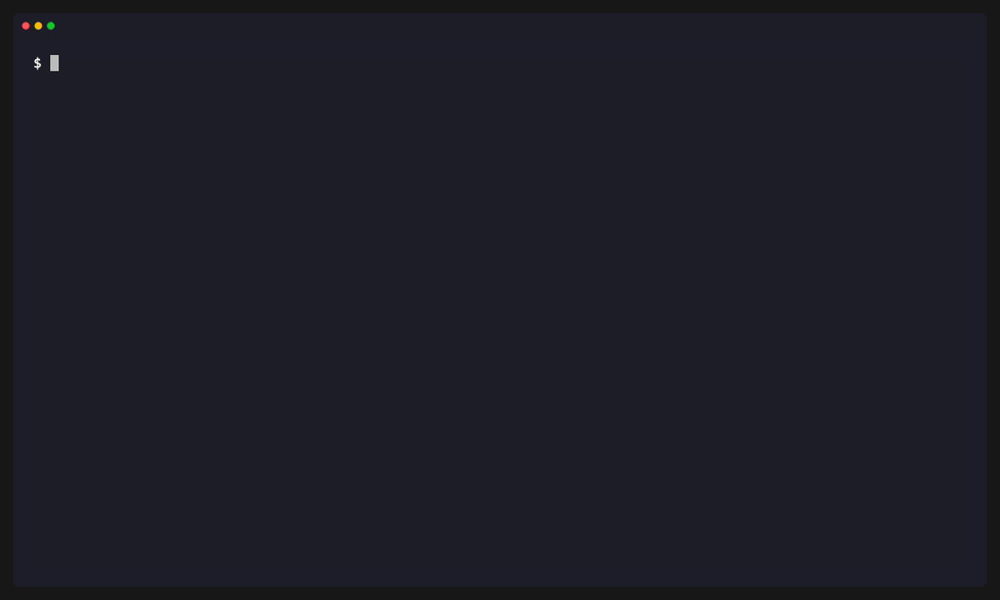

# depx

[](https://crates.io/crates/depx)
[](https://github.com/ruidosujeira/depx/actions/workflows/ci.yml)
[](https://opensource.org/licenses/MIT)

**Turn lockfiles, source evidence and advisories into dependency decisions you can review.**

<p align="center">
  
</p>

depx is a fast dependency analyzer for JavaScript/TypeScript and Rust. It combines the exact installed graph with evidence from source files, manifests, scripts and configuration, then explains what it knows, what it does not know and what to do next.

Its key distinction is the decision layer: `depx plan` prioritizes security upgrades, removal reviews, deprecated replacements and version consolidation using reachability, confidence, dependency chains and upgrade risk. Results can be governed with policies, baselines, deterministic JSON and SARIF.

## Why depx?

Dependency tools often answer only one question: what is installed, what is imported, or what is vulnerable. depx connects those facts so you can answer:

- Is this direct dependency referenced by a supported source, script or configuration collector?
- Is a vulnerable component in observed reachable code, and which direct dependency should be changed?
- Why is a transitive package present?
- Is an apparent unused dependency a confident result or a coverage limitation?
- Which changes should the team make first, and how risky is the target version?

No-evidence results are deliberately phrased as review candidates, not as proof that removal is safe.

## Installation

```bash
cargo install depx
```

Or build from source:

```bash
git clone https://github.com/ruidosujeira/depx
cd depx
cargo install --path .
```

## Quick start

Run commands from a project root. depx auto-detects npm, pnpm, Yarn or Cargo lockfiles.

```bash
depx analyze                 # findings, usage evidence and coverage
depx why <package>           # presence, dependency chains and evidence
depx audit --used-only       # known vulnerabilities in observed used code
depx plan                    # prioritized remediation decisions
depx deprecated              # deprecated installed packages
depx duplicates              # duplicate Cargo crate versions
```

This repository includes a small npm demo:

```bash
cargo run -- analyze examples/demo-app
cargo run -- plan examples/demo-app
```

## Actionable remediation plans

`depx plan` combines local analysis with OSV advisories and deprecation metadata:

```text
Dependency Remediation Plan

5 actions prioritized

1. [URGENT] Upgrade minimist 1.2.5 -> 1.2.6
   Reason: 1 critical vulnerability in reachable code
   Evidence: confirmed runtime usage; confidence high
   Advisories: GHSA-xvch-5gv4-984h
   Change risk: patch
   Suggested command: npm install minimist@1.2.6
```

Priority is based on advisory severity and observed reachability. Direct dependencies get package-manager-aware commands; transitive findings identify the remediation root and dependency chain. `--verbose` shows up to five shortest useful chains per component and `--json` emits the versioned plan schema.

```bash
depx plan
depx plan --verbose
depx plan --json > depx-plan.json
```

Suggested commands are starting points for review; depx does not modify manifests or lockfiles.

## Evidence-backed analysis

`depx analyze` reports structured findings and groups every component by its strongest supported evidence: runtime, development, build, test, configuration-only, transitive, ambiguous or no evidence.

```bash
depx analyze
depx analyze --unused
depx analyze --no-dev
depx analyze --json > depx-analysis.json
depx analyze --sarif > depx.sarif
depx analyze --fail-on warning
```

Options:

- `--unused` shows only components without supported usage evidence.
- `--no-dev` excludes direct development-only dependencies.
- `--json` emits deterministic structured analysis.
- `--sarif` emits SARIF 2.1.0 for code-scanning systems.
- `--fail-on <never|info|warning|error>` exits with code `1` when a finding reaches the threshold.
- `--verbose` includes complete explanations and evidence.

Built-in rules use stable identifiers:

| Rule | Meaning | Default severity |
|------|---------|------------------|
| `DX001` | Direct dependency without supported usage evidence | warning |
| `DX002` | Ambiguous component resolution | warning |
| `DX003` | Configuration-only direct dependency | info |
| `DX004` | Duplicate component versions or installations | info, elevated for multiple majors |
| `DX005` | Direct declaration used only transitively | info |

## Explain a dependency

```bash
depx why wrappy
depx why shared@2.0.0
```

`why` shows declaration or transitive presence evidence, source evidence, confidence, coverage limitations, related findings and up to five shortest useful chains from direct dependencies. Chain traversal is deterministic, cycle-safe and bounded for dense graphs. Qualify the version when multiple installed components share the same package name; when the same name/version has multiple installation locations, the CLI reports the ambiguity instead of guessing.

## Vulnerability gates

depx queries [OSV](https://osv.dev) with exact installed npm or crates.io versions. `--used-only` limits output to components reachable from observed usage evidence.

```bash
depx audit
depx audit --used-only
depx audit --fail-on critical
depx audit --fail-on never
```

The default threshold is `high`. Accepted values are `any`, `low`, `medium`, `high`, `critical` and `never`. Advisories without a usable textual severity or CVSS score are reported as `unknown`, never silently promoted to `medium`. `any` fails on unknown severity; numeric severity thresholds do not.

OSV requests use three bounded attempts for transient network errors and HTTP `429`, `500`, `502`, `503` and `504`, honoring a capped `Retry-After` value when present. If the final attempt fails, the audit fails closed as an operational error instead of reporting a clean result.

Exit codes:

- `0`: no reported vulnerability met the configured threshold.
- `1`: at least one reported vulnerability met the threshold.
- `2`: command-line, project, lockfile, network or OSV error.

## Policies and gradual adoption

Place `depx.toml` in the project root, or pass another file with the global `--config` option:

```toml
[policy]
fail_on = "warning"
baseline = "depx-baseline.json"

[[ignore]]
package = "generated-client"
rule = "DX001"
reason = "Loaded through generated registration code"
expires = "2026-12-31"
```

Unknown configuration fields are rejected. Every exception needs a non-empty reason. Expired exceptions stop suppressing findings and produce a warning. A package may be written as `name` or `name@version`; omit `rule` to match all findings for that package.

To adopt depx without failing on existing debt:

```bash
depx baseline
git add depx-baseline.json
depx analyze --fail-on warning
```

The baseline stores stable finding identities. Existing findings are suppressed while new or materially changed findings remain visible. Re-run `depx baseline --output <file>` only after reviewing the current state.

Policies and baselines currently apply to analysis findings and plans. Vulnerability gating remains controlled by `audit --fail-on`.

## CI integration

A minimal gate can run both local findings and version-aware vulnerabilities:

```bash
depx analyze --fail-on warning
depx audit --used-only --fail-on high
```

For a code-scanning system, save SARIF without changing the result stream:

```bash
depx analyze --sarif > depx.sarif
```

JSON, semantic baseline identities, plan action IDs and SARIF fingerprints are deterministic for the same project state. Finding fingerprints are independent from byte-offset-only source edits; evidence locations and spans remain available for diagnostics.

## Deprecated and duplicate packages

```bash
depx deprecated
depx duplicates
depx duplicates --verbose
depx duplicates --json
```

`deprecated` marks whether each package has observed usage. `duplicates` analyzes Cargo crates with multiple resolved versions and reports objective facts: exact installations, immediate dependents, direct roots, distinct majors and extra compile units. Three versions within one major remain low impact; different majors are medium impact. The command is informational and does not hard-code a CI failure from version count. Use policy-controlled `depx analyze --fail-on ...` and rule `DX004` when duplicate findings should gate CI.

## Supported project formats

| Project data | Support |
|--------------|---------|
| npm `package-lock.json` v1/v2/v3 | graph, manifests, workspaces and analysis |
| pnpm `pnpm-lock.yaml` v6-v9 layouts | graph, importers, workspaces and analysis |
| Yarn classic and modern `yarn.lock` | graph, workspaces and analysis |
| Rust `Cargo.lock` + `Cargo.toml` | graph, workspaces, renamed crates, analysis and duplicates |

JavaScript/TypeScript evidence includes static imports, CommonJS `require`, dynamic imports, re-exports, supported configuration files and scripts from every declared project unit. Node built-ins and their subpaths (for example `fs/promises`, `assert/strict` and `node:test`) are excluded. Rust evidence includes `use`, `extern crate`, crate-qualified paths and macro references, classified across runtime, build, test and development sources.

Workspace manifests become explicit project units. Each source observation is owned by its most specific declared unit and resolves only through that unit's exact declarations and package-manager context. Valid workspace members are scanned; unrelated nested projects are excluded. Yarn Berry locators, including virtual peer contexts, and pnpm peer-qualified locations remain distinct component identities.

Static analysis cannot prove absence. depx reports coverage limitations for computed module names, framework plugin discovery, arbitrary shell behavior, generated sources, conditional Rust compilation and macro expansion.

## How it works

| Stage | What happens |
|-------|--------------|
| Inventory | Parses the detected lockfile into normalized, versioned component identities and dependency edges. |
| Manifests | Produces explicit project units and resolves each declaration to an exact component in its package-manager context. |
| Evidence | Collects unit-owned source, script and configuration references with origin, role, confidence and exact or explicit ambiguous resolution. |
| Findings | Applies validated rules with stable IDs and explicit recommendations. |
| Advisories | Sends exact installed versions to OSV and marks observed reachability. |
| Decisions | Produces prioritized remediation actions, upgrade risk, commands and dependency roots. |
| Governance | Applies justified exceptions, baselines, failure thresholds and machine-readable output. |

The dependency direction is intentionally one-way: ecosystem adapters → normalized model/project units → evidence → usage assessment → findings → graph/advisories → remediation plan → policy and output. Finding rules do not contain package-manager resolution logic.

## Machine-readable schemas

Public machine-readable formats are explicitly versioned. The current analysis/finding schema, baseline schema, remediation-plan schema and duplicate-analysis schema are version `2`; SARIF uses the `depx/v2` fingerprint key. Version 2 introduces project units and evidence ownership, exact vulnerability component identity, semantic finding fingerprints and objective duplicate facts. Version 1 baselines must be regenerated with `depx baseline` because their occurrence-sensitive IDs are intentionally incompatible. See [docs/schemas.md](docs/schemas.md) for compatibility details.

## Development

```bash
cargo fmt --all --check
cargo clippy --all-targets --all-features -- -D warnings
cargo test --all-targets
```

See [CONTRIBUTING.md](CONTRIBUTING.md) for the development workflow, [SECURITY.md](SECURITY.md) for private vulnerability reporting and [CHANGELOG.md](CHANGELOG.md) for release notes.

## Built with AI

This project is built in partnership with AI coding tools. Architecture, product direction, review and responsibility remain with the maintainer; AI accelerates implementation. The disclosure is intentional.

## License

MIT
